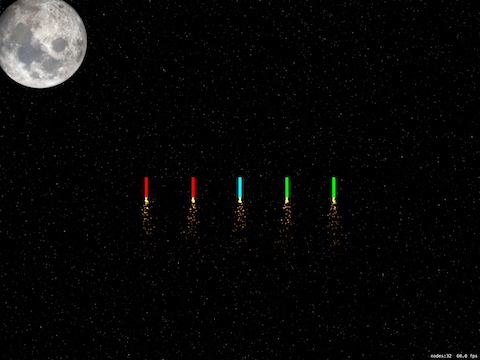

# Fireworks Night

## Description
Create fireworks displays using your fingers, touch the fireworks of the same color, shake the device and see them explode.

## Demo
### feature/setting-up
* Add the `Content` folder with the resources that we are going to use
* Clean the project.
  * On `GameScene.sks`
    * Delete the **Hello World `Node`**
    * On `attributes inspector` from `GameScene.sks`:
      * Change the `anchor point` for **`X`:0 `Y`:0**.
      * Change the size for **W:1024** **H:768** to match iPad `landscape` size.
          > Although there are iPads much bigger, `SpriteKit` takes care of it, so don't worry about this size.
  * Delete `Actions.sks`, move it to trash.

### feature/ready-aim-fire
| Screenshot 01 | Screenshot 02 |
| ------------- | ------------- |
|  |  |

| Screenshot 03 | Screenshot 04 |
| ------------- | ------------- |
|  |  |

### feature/swipe-to-select
| Screenshot 05 | Screenshot 06 |
| ------------- | ------------- |
|  |  |

### feature/making-things-go-bang
| Screenshot 07 |
| ------------- |
|  |

### feature/challenge
| Screenshot 08 (Add score label) | Screenshot 09 (Finish the game after some rounds) |
| ------------- | ------------- |
|  |  |

| Screenshot 10 (Remove particles after certain time) |
| ------------- |
|  |